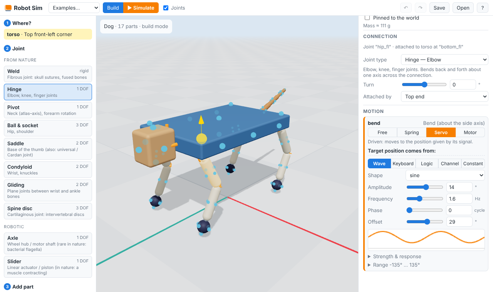
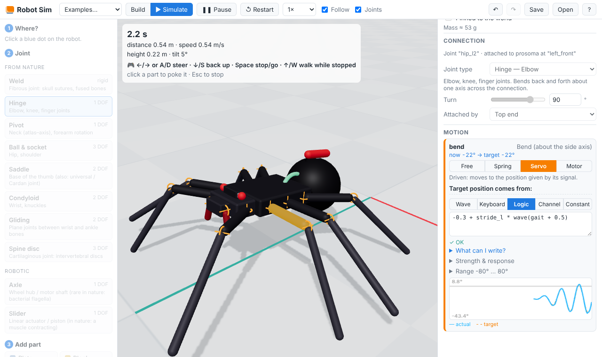

# Robot Sim

Snap robots together from simple building blocks — plates, rods, limbs, discs,
wheels, balls — using joints borrowed from anatomy (hinge, pivot, ball & socket,
saddle, condyloid, gliding, spine disc, weld) plus robotic ones (axle, slider).
Then decide, joint by joint, what is **free and floppy** and what **follows a
signal**: a wave, the keyboard, a logic formula reading sensors, or a controller
written in code. Press *Simulate* and the robot comes alive in a 3D physics world.




## Quick start

```bash
npm install
npm run dev        # open http://localhost:5173
npm test           # snapping, validation, joint physics, drives, whole-robot scenarios
npm run build      # type-check + production build into dist/
```

Node 22.12+ is required. Everything runs in the browser; physics is
[Rapier](https://rapier.rs) (WebAssembly), rendering is [three.js](https://threejs.org).

## Using it

**Build** (the default mode)

1. **Where?** Click one of the blue dots — the snap points. Dots hidden behind or
   under a part show through faintly and can be clicked too. A yellow arrow shows
   which way the new part will stick out.
2. **Joint:** pick how the new part connects.
3. **Part:** click a building block. It snaps on, and the dot at its far end is
   pre-selected so you can keep chaining (thigh → shin → paw).

Click a part to edit its size, density, friction and colour, its joint (type,
*turn* about the connection axis, which side of the part is attached) and — most
importantly — the **drive of every degree of freedom**. `R` / `Shift+R` turn the
selected part's joint by 90°, `Delete` removes the part and everything hanging off
it, `Ctrl+Z` / `Ctrl+Shift+Z` undo and redo. Clicking empty space opens the robot
panel: an overview of every joint coloured by its drive, the shared channels, and
any problems with the build.

**Simulate:** press *▶ Simulate*. Keys you hold go to the robot, clicking a part
pokes it, *Follow* keeps the camera on it, and drives and signals can be tuned
**live** while it runs (*Plot this* shows a joint's target vs. actual position).
`Esc` returns to building.

The current robot is saved in the browser automatically; *Save*/*Open* exchange
robots as JSON blueprints. *Examples…* loads one of the presets below.

## Building blocks

| Part | Shape | Snap points | Think of it as |
|---|---|---|---|
| Plate | flat box | 6 faces, 4 corners underneath, 4 on top, 4 wheel mounts on the sides | torso, pelvis, chassis |
| Block | box | 6 faces | head, hub, counterweight |
| Rod | thin cylinder | both ends, 4 around the middle | bone, strut |
| Limb | capsule (rounded ends) | both tips, 4 around the middle | femur, tibia, finger — the round tip makes a good foot |
| Cylinder | thick cylinder | end caps, 4 around the middle | vertebra, body segment |
| Disc | flat cylinder | both faces, 4 on the rim | shoulder blade, fin, foot pad |
| Wheel | rounded disc, grippy | both hubs | wheel |
| Ball | sphere | 6 points | paw, head, knuckle |

Every snap point is a small frame on the surface: a position, an outward
**normal** and an **up** direction. Snapping places the child so the two snap
points coincide, the normals point at each other and the "up" directions agree.

## Joints

A joint's frame sits on the parent's snap point: **Z** is the snap normal (along
the connection, "along the bone"), **Y** is the snap's up direction turned by the
joint's *turn* angle, **X** = Y × Z is the side axis.

| Joint | Found in | Degrees of freedom (axis) |
|---|---|---|
| Weld | fibrous joints: skull sutures | none |
| Hinge | elbow, knee, fingers | bend (X) |
| Pivot | neck (atlas–axis), forearm rotation | twist (Z) |
| Ball & socket | hip, shoulder | bend (X), swing (Y), twist (Z) |
| Saddle | base of the thumb (a universal joint) | bend (X), swing (Y) |
| Condyloid | wrist, knuckles | bend (X), small swing (Y) |
| Gliding | plane joints between wrist/ankle bones | shift sideways (X), shift up (Y) |
| Spine disc | intervertebral discs (cartilaginous) | springy bend, swing, twist |
| Axle *(robotic)* | wheel hub, motor shaft | spin (Z), unlimited |
| Slider *(robotic)* | piston / linear actuator (≈ a muscle contracting) | slide (Z) |

Each DOF has a range (limits) and a starting position, both editable. Parts
joined directly never collide with each other; other parts of the same robot do
(switchable), except pairs that already overlap when snapped together, which are
told to ignore each other rather than explode apart.

## Free or driven: drives and signals

Every degree of freedom gets one of four **drives**:

| Drive | Passive? | Behaviour |
|---|---|---|
| **Free** | passive | flaps around; only a little friction |
| **Spring** | passive | elastic: pulls back towards a rest position (stiffness, damping), like a tendon |
| **Servo** | driven | moves to the *position* its signal asks for (stiffness, damping, max torque) |
| **Motor** | driven | turns / slides at the *speed* its signal asks for (gain, max torque) |

The max torque (or force) is real: a weak servo cannot lift a heavy limb.

Driven DOFs read a **signal**:

- **Wave** — `offset + amplitude · shape(frequency · t + phase)` with shapes
  sine, square, triangle, saw and pulse (a half-sine bump, handy to lift a foot
  only while it swings). Phase is in cycles, so legs half a step apart differ by 0.5.
- **Keyboard** — a value while keys are held (with optional smoothing), or in
  *hold* mode the keys jog the value and it stays where you leave it.
- **Logic** — a formula, e.g. `key("w") ? 0.4 * sin(2*pi*1.5*t) : 0`.
- **Channel** — a named signal shared by the whole robot (one gait clock for all legs).
- **Constant**.

### The logic language

Values are SI units (radians, metres, seconds); booleans are 1/0.

| | |
|---|---|
| operators | `+ - * / % ^`, `< <= > >= == !=`, `&& \|\| !`, `cond ? a : b` |
| variables | `t`, `dt`, `pi`, `tau`, and root-body sensors `roll`, `pitch`, `yaw`, `height`, `x`, `z`, `vx`, `vy`, `vz`, `speed`, `forward` |
| waves (u in cycles) | `wave(u)` `square(u)` `tri(u)` `saw(u)` `pulse(u)` |
| keyboard | `key("w")`, `axis("up", "down")` (+1 / −1 / 0), `toggle("space")` (flips on each press) |
| sensors | `angle("knee")`, `angle("hip.swing")`, `speed("wheel")`, `touching("paw")`, `ch("gait")` or just `gait` |
| memory | `smooth(x, seconds)`, `hold(x, condition)`, `integrate(x, min, max)` |
| math | `sin cos tan asin acos atan atan2 abs sign sqrt pow exp log floor ceil round fract hypot min max mod clamp lerp step smoothstep deg rad` |

Formulas are parsed into closures (no `eval`) and checked against the robot as
you type: unknown joints, DOFs, parts or channels are reported with a position.

## Examples

| Example | Shows |
|---|---|
| **Dog** | The robot you start with: a steerable trotting quadruped. One `gait` clock drives servo hips and knees, diagonal legs in step; reflexes on `roll` and `pitch` extend the legs on the low side, and each paw sits on a *gliding* ankle that sweeps it sideways in stance — which is what lets a trot turn without its feet skidding. It walks off on its own: ←/→ steer, ↓ backs up, Space stops and starts it. Springy tail, floppy ears, and a head that looks into turns. |
| **Spider** | An arachnid: eight legs fanned out like a spider's, walking an alternating tetrapod gait (L1 R2 L3 R4, then the other four). Each leg is two hinges — a hip turned a quarter turn swings it fore and aft, a knee lifts it. Steers like the dog and spins on the spot; the abdomen bobs on a spring and the fangs twitch. |
| **Salamander** | A sprawling quadruped whose spine and tail swing in a wave locked to the legs. Timed right, the wave lengthens the stride (about 40% faster than the legs alone); timed wrong, it stalls. The neck turns against the wave to keep the head steady, and it steers by bending its spine. |
| **Hexapod** | Tripod gait; every hip is a *saddle* joint with both axes driven by different waves. |
| **Rover** | Four wheel motors mixing `throttle` and `steer` channels built from the keyboard (arrows / WASD); a springy antenna. |
| **Balancer** | A two-wheeled inverted pendulum that stays up only through feedback: logic channels turn `pitch` into a lean, a speed loop on `forward` decides the lean it should hold, and the wheels run at `300 · ∫error + 60 · error`. Drive with ↑/↓, turn with ←/→, shove its head; its arms swing free. |
| **Snake** | A travelling wave down a chain of servo hinges; free-spinning side wheels give the grip that turns it into forward motion. |
| **Robot arm** | Pinned to the floor; keys jog the turntable (pivot), shoulder, elbow and wrist (condyloid); the fingers dangle on free hinges. |
| **Pendulum chain** | Nothing driven at all: a hinge and ball joints released from a bent pose. |
| **Empty plate** | Start from scratch. |

## Making a walker work

The Dog, Spider and Salamander are built from the same recipe:

- **Single-axis joints in a chain.** Legs are hinges: a hip, then a knee. On a
  side snap, a hinge turned a quarter turn (`R`) swings the leg fore and aft;
  the next hinge, turned back, bends it down. Joints with several *driven*
  rotation axes (saddle, ball, condyloid) are solved together by the physics
  engine and go soft when they are bent and carrying weight — fine for a wrist
  or a tail, not for a leg. Avoid small, light parts sandwiched between two
  joints: a chain sags at such a link.
- **One clock for every leg.** A channel `gait = integrate(2)` counts gait
  cycles. Each hip follows `rest + stride * wave(gait + phase)` and each knee
  `bend - lift * pulse(gait + phase + 0.75)`, which lifts the foot only while it
  swings forward. The phases make the gait: diagonal pairs at 0 and 0.5 trot,
  alternating groups of three or four legs make tripod and tetrapod gaits.
- **Reflexes.** `roll` and `pitch` read the body's lean. Adding them to the
  legs' crouch (`0.5 + roll + 0.25 * pitch` on the front left leg) extends the
  legs on the low side, which keeps a trotting dog from tipping over.
- **Turning needs sideways motion.** Feet in stance cannot skid, so a trot
  whose legs only swing fore and aft goes straight however unequal the strides
  are. Something has to move feet or body sideways: the Dog's paws glide, the
  Salamander bends its spine, the Spider's fanned legs already push sideways.
- **Steering with heading hold.** `heading = hold(yaw, steer != 0)` remembers
  where the robot pointed when the keys were released, and
  `atan2(sin(heading - yaw), cos(heading - yaw))` is the error to steer by.

## Blueprints and the code API

A robot is a plain JSON blueprint — parts, joints between snap points, per-DOF
drives and signals, and channels. This one is [`examples/kicker.json`](examples/kicker.json)
(load it with *Open*):

```json
{
  "format": "robot-sim/blueprint", "version": 1, "name": "Kicker",
  "parts": [
    { "id": "base", "type": "block", "pinned": true },
    { "id": "leg", "type": "bone", "size": { "length": 0.3 } }
  ],
  "joints": [{
    "id": "knee", "type": "hinge",
    "parent": { "part": "base", "snap": "bottom" },
    "child": { "part": "leg", "snap": "top" },
    "dofs": { "bend": { "drive": { "mode": "servo",
      "signal": { "kind": "expression", "expr": "key(\"space\") ? -1.2 : 0.2" } } } }
  }],
  "spawn": { "position": { "x": 0, "y": 0.8, "z": 0 } }
}
```

The same can be built and simulated from TypeScript (this is how the presets
and tests are written):

```ts
import { RobotBuilder } from './src/core/builder';
import { Simulation } from './src/physics/simulation';

const bp = new RobotBuilder('Pendulum')
  .root('base', 'block', { pinned: true })
  .attach('swing', 'hinge', 'base.bottom', { id: 'arm', type: 'rod' }, {
    dofs: { bend: { initial: 1, drive: { mode: 'free' } } },
  })
  .spawn({ position: { x: 0, y: 1, z: 0 } })
  .build(); // validates

const sim = await Simulation.create();
const robot = sim.addRobot(bp);

// Optional: a controller in code instead of (or on top of) signals.
sim.addController(() => {
  const lean = robot.bodySensor('roll');
  // robot.brain.setOverride('some_joint', 'bend', -2 * lean);
});

sim.advance(2); // seconds
console.log(robot.jointPosition('swing'), robot.worstConnection());
```

## Tests

`npm test` runs Vitest suites (about 35 s):

- **parts** — every snap point lies on its part's surface, with an outward unit normal and a perpendicular up.
- **assembly** — every part type snaps onto every other at every pair of snap points (over 1,000 combinations) with zero gap and opposed normals; turning, starting poses, long chains, spawning on the ground.
- **blueprint** — validation catches duplicate ids, unknown parts/snaps/joints/DOFs, a snap used twice, two parents, loops, disconnected parts, bad limits, broken formulas and circular channels; JSON round-trips.
- **edit** — building a walker click by click through the same operations the UI uses.
- **signals / brain** — the expression language, waves, keyboard modes, channels, overrides.
- **physics-joints** — in Rapier, every joint type stays connected (sub-millimetre, sub-degree) while being thrown around and respects its limits; free joints swing, springs return, servos track, motors spin, strength limits bind, logic can read other joints, overlapping parts ignore each other, live retuning works; touch sensors count only real contact; wheels roll without hopping and the ground follows robots that travel far, even in opposite directions.
- **scenarios** — the dog trots off, steers both ways and holds its new heading, backs up, stops and restarts on Space and keeps its feet when poked, for any solver quality from 8 to 16 iterations; the spider walks on its feet alone in two alternating groups of four legs, steers and spins on the spot; the salamander owes much of its speed to its body wave and stalls when the wave is mistimed; the balancer stays up only with its feedback loop, drives, turns and catches a shove to the head; the hexapod walks, the rover drives and turns on the right keys, the snake's motion comes from its wave, the arm jogs and holds, the pendulum conserves energy.

## How it is put together

```
src/
  core/        engine-agnostic model (pure TypeScript, unit-tested)
    parts.ts       building blocks and their snap points
    joints.ts      joint types and their degrees of freedom
    blueprint.ts   the JSON format, validation, helpers
    assembly.ts    snapping: blueprint → posed parts and joint frames
    drives.ts      free / spring / servo / motor
    signals.ts     wave, keyboard, logic, channel, constant
    expression.ts  the logic language (tokenizer + compiler to closures)
    brain.ts       evaluates channels and signals into joint targets each step
    edit.ts        pure editing operations used by the UI (undo-friendly)
    builder.ts     fluent API for writing blueprints in code
  physics/
    simulation.ts  Rapier world: one rigid body per part, one generic joint per
                   joint (free axes = the DOFs), joint motors for drives
  render/        three.js: viewport, part meshes, joint gizmos, snap markers
  ui/            panels, inspector, signal editor, scope; App.ts wires it all up
  presets/       the example robots (walker.ts: the steering brain the walkers share)
tests/           Vitest suites
```

Physics notes: the world steps at 240 Hz with 12 solver iterations. Each
joint's two local frames are exactly the frames from the assembly, so a DOF
reading of zero always means "as snapped together". Servos use Rapier's implicit
PD motors (stable at high stiffness) with a torque cap; free joints use a
zero-speed velocity motor as viscous friction. Rapier pushes each driven axis of
a multi-axis joint about the parent's fixed axis, which stops matching the
measured angle once the joint is bent, and it does not carry joint impulses over
from one step to the next — so such a joint holds much less firmly than a hinge
when it is bent and loaded (see *Making a walker work*). The ground is a 40 m slab that slides along under
the robots (and widens if several of them spread out): against a much larger box Rapier's contacts dip by millimetres,
enough to make a slowly rolling wheel hop. `touching()` counts contact within
3 mm, because Rapier also reports predicted contacts centimetres away.
